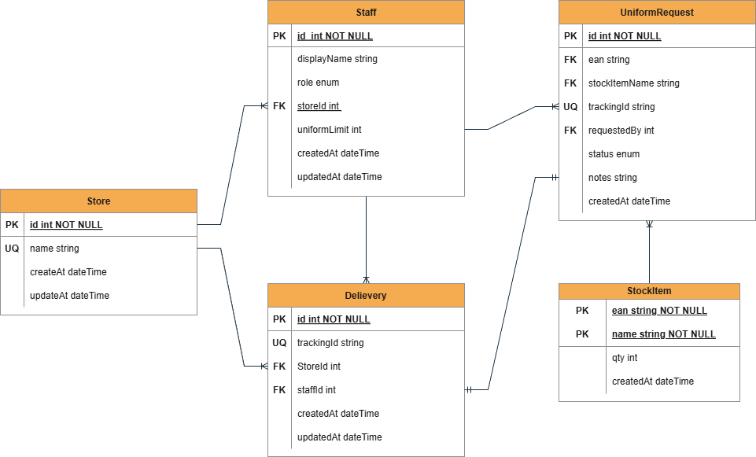

## Uniform Ordering System

A dedicated uniform ordering platform for store managers and dispatch teams to streamline staff uniform requests, track order status, and manage stock efficiently.

## Tech Stack

* Front-end: Next.js, Tailwindcss, Lucide React, Chart.js.
* Back-end: Next.js API, Prisma, SQLite.

## Key Features

* Import Data 
* Create Uniform Request
* Re-order Feature
* Tracking System
* Dispatch Team Management System

## Furture Development Plan

- Add more user roles with different permissions and features.
- Complete tracking dashboard for the dispatch team to streamline the courier process.
- Delivery service options for dispatch team.
- Implement and Optimize database design for performance.
- Adopt authorization system for better security.

## Crucial Decision.

- The duplicationa of EAN field in the Stock CSV file was first handled by increase the unit place of a duplicated numbers until it becomes unique. However, this handling way makes the method becomes hardcode. Therefore, composite primary key was used in this case to ensure the uniqueness.

- Managers can manually mark a request as Collected to handle real-world cases where the dispatch or delivery service fails to update parcel status. This ensures staff are informed that their uniforms have arrived, while allowing the dispatch team to maintain accurate stock and order tracking for better visibility.

## Database design

